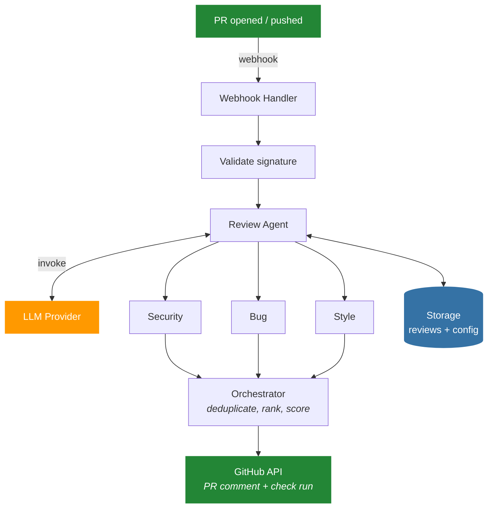

<p align="center">
  
</p>

<p align="center">
  <strong>AI-powered PR reviews. Your cloud, your models, your rules.</strong>
</p>

<p align="center">
  <a href="https://github.com/santthosh/mergewatch.ai/actions"></a>
  <a href="https://github.com/santthosh/mergewatch.ai/actions/workflows/docker-publish.yml"></a>
  <a href="https://github.com/santthosh/mergewatch.ai"></a>
  <a href="https://github.com/santthosh/mergewatch.ai/issues"></a>
  
  
  
  
  <a href="LICENSE"></a>
  
</p>

---

MergeWatch is an open-source GitHub App that reviews pull requests using a multi-agent AI pipeline. Deploy it your way: **SaaS** on AWS Lambda + Bedrock, or **self-hosted** with Docker + Postgres + any LLM provider.

## Highlights

- **Multi-agent pipeline** — parallel security, bug, and style agents with an orchestrator that deduplicates and ranks findings
- **Merge readiness score** — every PR gets a clear 1-5 rating so you know at a glance if it's safe to merge
- **Any LLM provider** — Anthropic, Bedrock, LiteLLM (100+ providers), or Ollama for air-gapped
- **Two deployment modes** — SaaS (Lambda + DynamoDB + Bedrock) or self-hosted (Docker + Postgres)
- **Smart skip** — auto-skips trivial PRs (lock files, docs, config) to save cost
- **GitHub Checks** — pass/fail status in the PR merge box with a link to the dashboard
- **Mermaid diagrams** — auto-generated architecture diagrams of changes
- **Confidence scores** — per-finding confidence so you can triage effectively
- **Dashboard** — full-featured Next.js dashboard with light/dark themes
- **Per-repo config** — `.mergewatch.yml` for fine-grained control

## How it works



## Quick start

### Self-hosted (Docker)

Three services — server, dashboard, Postgres. One command.

```bash
git clone https://github.com/santthosh/mergewatch.ai.git && cd mergewatch.ai
cp .env.example .env
```

Fill in your `.env` (see [Environment variables](#environment-variables) below):

```bash
docker-compose up -d
```

Verify everything is running:

```bash
curl http://localhost:3000/health
# → { "status": "ok", "version": "0.2.0", "db": "connected", "llmProvider": "anthropic" }
```

Open the dashboard at **http://localhost:3001**, sign in with GitHub, and install the app on your repos.

> **No AWS. No IAM. No SAM.** Just Docker.
>
> For production with HTTPS, see [docs/reverse-proxy.md](docs/reverse-proxy.md) — Caddy (recommended), nginx, or tunnel options.

#### What `docker-compose up` starts

| Service | Port | Image |
|---------|------|-------|
| **mergewatch** (server) | 3000 | `ghcr.io/santthosh/mergewatch:latest` |
| **dashboard** (Next.js) | 3001 | `ghcr.io/santthosh/mergewatch-dashboard:latest` |
| **db** (PostgreSQL 16) | 5432 | `postgres:16-alpine` |

Pre-built images are published to GHCR on every push to `main`. Upgrade with:

```bash
docker-compose pull && docker-compose up -d
```

#### Environment variables

Create a [GitHub App](https://github.com/settings/apps/new) first (permissions: `pull_requests` rw, `contents` r, `checks` rw, `issues` rw; events: `pull_request`, `issue_comment`, `installation`).

| Variable | Required | Notes |
|----------|----------|-------|
| `GITHUB_APP_ID` | Yes | From GitHub App settings |
| `GITHUB_WEBHOOK_SECRET` | Yes | Set when creating the app |
| `GITHUB_PRIVATE_KEY` | Yes* | Inline PEM with `\n` escaping |
| `GITHUB_PRIVATE_KEY_FILE` | Yes* | Path to `.pem` file (alternative) |
| `GITHUB_CLIENT_ID` | Yes | GitHub App → OAuth Credentials |
| `GITHUB_CLIENT_SECRET` | Yes | GitHub App → OAuth Credentials |
| `NEXTAUTH_SECRET` | Yes | `openssl rand -base64 32` |
| `LLM_PROVIDER` | Yes | `anthropic` (default) / `litellm` / `ollama` / `bedrock` |
| `ANTHROPIC_API_KEY` | If anthropic | |
| `DASHBOARD_URL` | No | Default: `http://localhost:3001` |

\*Exactly one of `GITHUB_PRIVATE_KEY` or `GITHUB_PRIVATE_KEY_FILE` is required.

`GITHUB_CLIENT_ID` and `GITHUB_CLIENT_SECRET` come from the **same GitHub App** — every GitHub App has built-in OAuth credentials under **Settings → OAuth Credentials**.

See `.env.example` for the full list including LiteLLM, Ollama, and Bedrock options.

### AWS SaaS (Lambda + Bedrock)

```bash
git clone https://github.com/santthosh/mergewatch.ai.git && cd mergewatch.ai
pnpm install

# Create a GitHub App (https://github.com/settings/apps/new)
#   Permissions: pull_requests (rw), contents (r), checks (rw)
#   Events: pull_request, issue_comment

./scripts/setup-ssm.sh    # Store GitHub credentials in SSM
./scripts/deploy.sh       # Deploy via SAM
# Set the webhook URL printed by deploy in your GitHub App settings
```

See [docs/aws-setup.md](docs/aws-setup.md) for the full guide.

## LLM providers

| Provider | `LLM_PROVIDER` | Needs AWS? | Notes |
|----------|----------------|------------|-------|
| **Anthropic** | `anthropic` | No | Recommended default. Just an API key. |
| **LiteLLM** | `litellm` | No | OpenAI-compatible proxy — unlocks 100+ providers (OpenAI, Azure, Gemini, Mistral...) |
| **Amazon Bedrock** | `bedrock` | Yes | SaaS default. IAM-native, zero API keys. |
| **Ollama** | `ollama` | No | Local/air-gapped. Experimental. |

## Configuration

Drop a `.mergewatch.yml` in your repo root:

```yaml
version: 1
model: anthropic.claude-sonnet-4-20250514

agents:
  - name: security
    enabled: true
  - name: logic
    enabled: true
  - name: style
    enabled: true

rules:
  max_files: 50
  ignore_patterns:
    - "*.lock"
    - "vendor/**"
    - "dist/**"
  auto_review: true
```

| Key | Default | Description |
|-----|---------|-------------|
| `model` | Claude Sonnet | LLM model ID |
| `agents[].enabled` | `true` | Toggle individual agents |
| `rules.max_files` | `50` | Skip review above this file count |
| `rules.ignore_patterns` | `[]` | Glob patterns to exclude |
| `rules.auto_review` | `true` | Review on every PR open/push |

## Why MergeWatch?

| | MergeWatch | SaaS alternatives |
|---|---|---|
| **Deployment** | Self-hosted or SaaS | SaaS only |
| **Model choice** | Any provider | Vendor-locked |
| **Data residency** | Your infra / region | Vendor cloud |
| **Auth** | IAM or env vars | API key per org |
| **Review pipeline** | Multi-agent + orchestrator | Single-pass |
| **Config** | `.mergewatch.yml` per repo | Limited |
| **Source** | AGPL-3.0 open source | Proprietary |

## Project structure

pnpm monorepo with Turborepo. Provider interfaces in `core/` enable pluggable storage and LLM backends.

```
packages/
  core/              # Interfaces, review pipeline, agents, types. No cloud deps.
  storage-dynamo/    # DynamoDB storage (SaaS)
  storage-postgres/  # Postgres/Drizzle storage (self-hosted)
  llm-bedrock/       # Amazon Bedrock LLM
  llm-anthropic/     # Anthropic direct API
  llm-litellm/       # LiteLLM proxy (100+ providers)
  llm-ollama/        # Ollama (local, experimental)
  lambda/            # AWS Lambda handlers (SaaS)
  server/            # Express server (self-hosted)
  dashboard/         # Next.js 14 dashboard
infra/               # AWS SAM template
scripts/             # Setup & deploy scripts
```

## Development

```bash
pnpm install                   # Install all workspace dependencies
pnpm run build                 # Build all packages (respects dependency order)
pnpm run typecheck             # Type-check all packages
pnpm run deploy:dev            # Deploy backend to dev stage

cd packages/dashboard
pnpm run dev                   # Dashboard local dev server (localhost:3000)
```

## Contributing

Contributions are welcome! Fork the repo, create a feature branch, and open a PR.

```bash
git checkout -b feat/my-feature
git commit -m 'Add my feature'
git push origin feat/my-feature
```

## License

AGPL-3.0
