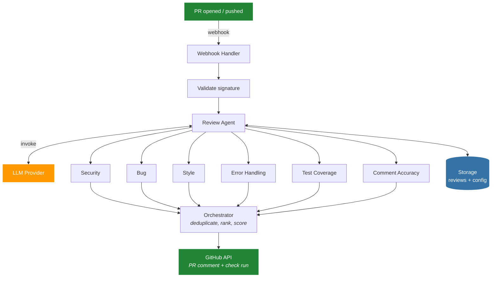

<p align="center">
  
</p>

<p align="center">
  <strong>Open-source AI code reviews for every pull request.</strong>
</p>

<p align="center">
  <a href="https://github.com/santthosh/mergewatch.ai/actions/workflows/ci.yml"></a>
  <a href="https://github.com/santthosh/mergewatch.ai/actions/workflows/docker-publish.yml"></a>
  
  <a href="https://github.com/santthosh/mergewatch.ai"></a>
  <a href="https://github.com/santthosh/mergewatch.ai/issues"></a>
  <a href="LICENSE"></a>
  
</p>

---

MergeWatch is a GitHub App that reviews every pull request with a team of specialized AI agents running in parallel. Security, bugs, style, error handling, test coverage, and comment accuracy are each reviewed independently, then an orchestrator deduplicates findings and scores merge readiness from 1 to 5.

Install it on your repos and it just works. Every PR gets a structured review comment, a Check Run in the merge box, and optionally a Mermaid architecture diagram of the changes.

## What you get

- **6 review agents + 2 utilities** running in parallel (security, bug, style, error handling, test coverage, comment accuracy — plus summary and diagram generators)
- **Merge readiness score** (1-5) on every PR so you know at a glance if it's safe to merge
- **Any LLM** — Anthropic, AWS Bedrock, LiteLLM (100+ providers), or Ollama for fully local/air-gapped
- **Smart skip** — auto-detects trivial PRs (lock files, docs, config) and skips them to save cost
- **GitHub Checks integration** — pass/fail in the PR merge box
- **Mermaid diagrams** — auto-generated architecture diagram of each PR's changes
- **Codebase awareness** — agents can request and read source files beyond the diff for deeper context
- **Re-review on demand** — comment `@mergewatch review` to re-run, `@mergewatch summary` for a summary, or ask questions with `@mergewatch <your question>`
- **Per-repo config** — drop a `.mergewatch.yml` to customize models, agents, rules, and tone
- **Dashboard** — Next.js app with analytics, review history, settings, and light/dark themes

## Quick start (Docker)

Three services. One command. No cloud account required.

```bash
git clone https://github.com/santthosh/mergewatch.ai.git && cd mergewatch.ai
cp .env.example .env
# Fill in your GitHub App credentials and LLM provider (see below)
docker compose up -d
```

Verify:

```bash
curl http://localhost:3000/health
# { "status": "ok", "version": "0.1.0", "db": "connected", "llmProvider": "anthropic" }
```

Dashboard at **http://localhost:3001**. Sign in with GitHub and install the app on your repos.

> **No AWS. No IAM. No SAM.** Just Docker.

| Service | Port | Image |
|---------|------|-------|
| **mergewatch** (server) | 3000 | `ghcr.io/santthosh/mergewatch:0.1.0` |
| **dashboard** (Next.js) | 3001 | `ghcr.io/santthosh/mergewatch-dashboard:0.1.0` |
| **db** (PostgreSQL 16) | 5432 | `postgres:16-alpine` |

Pre-built images are published to GHCR on pushes to `main` that change relevant source files, and on every GitHub Release. Upgrade with `docker compose pull && docker compose up -d`.

### Environment variables

Create a [GitHub App](https://github.com/settings/apps/new) first (permissions: `pull_requests` rw, `contents` r, `checks` rw, `issues` rw; events: `pull_request`, `issue_comment`, `installation`).

| Variable | Required | Notes |
|----------|----------|-------|
| `GITHUB_APP_ID` | Yes | From GitHub App settings |
| `GITHUB_WEBHOOK_SECRET` | Yes | Set when creating the app |
| `GITHUB_PRIVATE_KEY` | Yes* | Inline PEM with `\n` escaping |
| `GITHUB_PRIVATE_KEY_FILE` | Yes* | Path to `.pem` file (alternative) |
| `GITHUB_CLIENT_ID` | Yes | GitHub App OAuth credentials |
| `GITHUB_CLIENT_SECRET` | Yes | GitHub App OAuth credentials |
| `NEXTAUTH_SECRET` | Yes | `openssl rand -base64 32` |
| `LLM_PROVIDER` | Yes | `anthropic` / `litellm` / `ollama` / `bedrock` |
| `ANTHROPIC_API_KEY` | If anthropic | |

\*Exactly one of `GITHUB_PRIVATE_KEY` or `GITHUB_PRIVATE_KEY_FILE` is required.

See `.env.example` for the full list including LiteLLM, Ollama, and Bedrock options.

## How it works



1. A PR is opened or updated. GitHub sends a webhook.
2. The webhook handler validates the signature and dispatches the review job.
3. The review agent fetches the PR diff and context, then runs all enabled agents in parallel.
4. Each agent analyzes the diff through its specialized lens and returns structured findings.
5. The orchestrator merges results, removes duplicates, ranks by severity, and assigns a merge score.
6. A formatted comment is posted to the PR with findings, summary, diagram, and score. A Check Run is created in the merge box.

## LLM providers

| Provider | `LLM_PROVIDER` | Needs AWS? | Notes |
|----------|----------------|------------|-------|
| **Anthropic** | `anthropic` | No | Recommended default. Just an API key. |
| **LiteLLM** | `litellm` | No | OpenAI-compatible proxy — 100+ providers (OpenAI, Azure, Gemini, Mistral...) |
| **Amazon Bedrock** | `bedrock` | Yes | IAM-native, zero API keys. |
| **Ollama** | `ollama` | No | Local/air-gapped. Experimental. |

## Configuration

Drop a `.mergewatch.yml` in your repo root:

```yaml
model: anthropic.claude-sonnet-4-20250514

# Toggle built-in agents on/off
agents:
  security: true
  bugs: true
  style: true
  errorHandling: true
  testCoverage: false
  commentAccuracy: true
  summary: true
  diagram: true

# Add custom agents alongside built-in ones
customAgents:
  - name: tests
    prompt: "Suggest missing unit tests for new public functions."
    severityDefault: info
    enabled: false

rules:
  maxFiles: 50
  ignorePatterns:
    - "*.lock"
    - "vendor/**"
    - "dist/**"
  autoReview: true
  reviewOnMention: true
  skipDrafts: true

excludePatterns:
  - "**/*.lock"
  - "**/dist/**"

# Review tone: collaborative | direct | advisory
tone: collaborative

maxFindings: 25
```

Settings can also be managed from the dashboard (per-installation).

## Interacting via comments

| Comment | What happens |
|---------|--------------|
| `@mergewatch review` | Re-run a full review on the current commit |
| `@mergewatch summary` | Get a summary without detailed findings |
| `@mergewatch <question>` | Ask a question about the PR — gets a conversational response using the review context |

## Project structure

pnpm monorepo with Turborepo. Provider interfaces in `core/` enable pluggable storage and LLM backends.

```
packages/
  core/              # Interfaces, review pipeline, agents, types. No cloud deps.
  storage-dynamo/    # DynamoDB storage
  storage-postgres/  # Postgres/Drizzle storage
  llm-bedrock/       # Amazon Bedrock LLM
  llm-anthropic/     # Anthropic direct API
  llm-litellm/       # LiteLLM proxy (100+ providers)
  llm-ollama/        # Ollama (local, experimental)
  lambda/            # AWS Lambda handlers
  server/            # Express server (self-hosted)
  billing/           # Billing logic (SaaS)
  dashboard/         # Next.js 15 dashboard
infra/               # AWS SAM template
scripts/             # Setup & deploy scripts
```

## Development

```bash
pnpm install            # Install all workspace dependencies
pnpm run build          # Build all packages (respects dependency order)
pnpm run test           # Run all tests (~380 tests across 8 packages)
pnpm run typecheck      # Type-check all packages

cd packages/dashboard
pnpm run dev            # Dashboard local dev (localhost:3000)
```

## Testing

The project has comprehensive unit tests covering core review logic, all LLM providers, webhook handlers, billing, and the agent pipeline. Tests run on every PR via GitHub Actions.

```bash
pnpm run test           # Run all tests (~1-2 seconds)
pnpm run test:coverage  # Run with coverage report
```

## Releasing

MergeWatch uses [semantic versioning](https://semver.org/) with a single release script that updates all packages, Docker images, and changelog in one step.

### Cutting a release

```bash
# 1. Make sure you're on main with a clean tree
git checkout main && git pull

# 2. Run the release script (bumps versions, updates changelog, commits, tags)
./scripts/release.sh 0.2.0

# 3. Push the commit and tag
git push && git push --tags

# 4. Create a GitHub Release (triggers Docker image builds)
gh release create v0.2.0 --generate-notes
```

### What happens automatically

| Trigger | Action |
|---------|--------|
| `gh release create` | Docker images built and pushed to GHCR with semver tags (`0.2.0`, `0.2`, `latest`) |
| Push to `main` | SAM deploy to dev (auto), prod (manual approval via GitHub environment) |
| Push to `main` | Docker `:latest` and SHA-tagged images published |

### What the release script does

`scripts/release.sh <version>` automates:
1. Updates `version` in root + all 11 workspace `package.json` files
2. Updates the server health check version string
3. Updates `docker-compose.yml` image tags to the new version
4. Generates a changelog section from conventional commits (feat/fix/other)
5. Commits as `chore: release vX.Y.Z` and creates an annotated git tag

### Docker image tags

Images are published to `ghcr.io/santthosh/mergewatch` and `ghcr.io/santthosh/mergewatch-dashboard`:

| Tag | When |
|-----|------|
| `0.2.0` | On GitHub Release for `v0.2.0` |
| `0.2` | On GitHub Release for `v0.2.x` (tracks latest patch) |
| `latest` | On every push to `main` |
| `abc1234` | On every push to `main` (commit SHA) |

### Upgrading self-hosted

```bash
# Pin to a specific version in docker-compose.yml, then:
docker compose pull && docker compose up -d
```

## Why MergeWatch?

| | MergeWatch | SaaS alternatives |
|---|---|---|
| **Deployment** | Self-hosted (Docker) or cloud | SaaS only |
| **Model choice** | Any LLM provider | Vendor-locked |
| **Data residency** | Your infra, your region | Vendor cloud |
| **Review pipeline** | 6 parallel agents + orchestrator | Single-pass |
| **Codebase awareness** | Agents fetch files beyond the diff | Diff-only |
| **Config** | `.mergewatch.yml` per repo | Limited |
| **Source** | AGPL-3.0 open source | Proprietary |
| **Cost** | Pay your LLM provider directly | Per-seat pricing |

## Contributing

Contributions welcome! Please open an issue first for larger changes so we can discuss the approach.

```bash
git checkout -b feat/my-feature
# Make your changes
pnpm run build && pnpm run test    # Verify everything passes
git push origin feat/my-feature     # Open a PR
```

MergeWatch will automatically review your PR.

## License

[AGPL-3.0](LICENSE)
